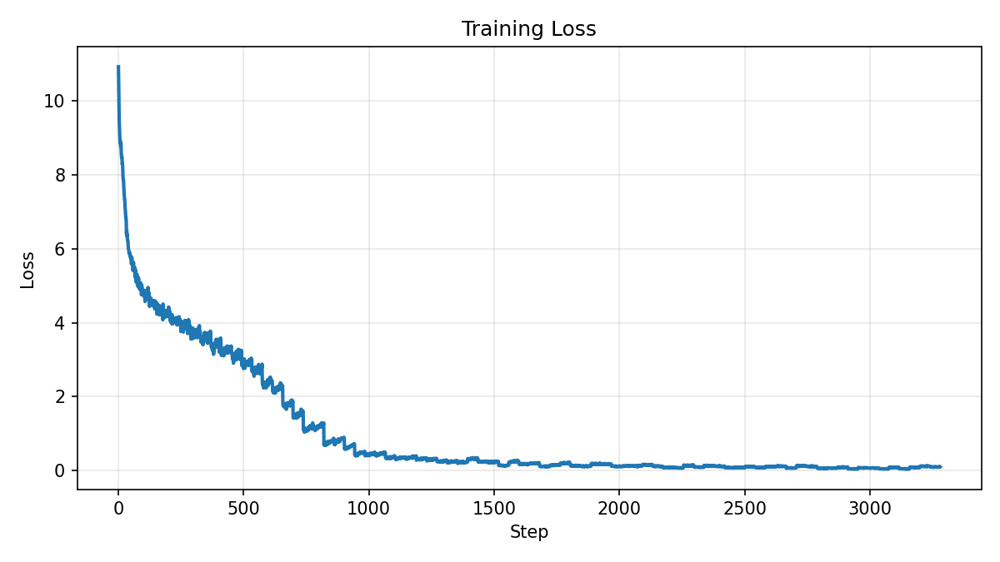

# GPT-2 from scratch in C++/CUDA

A GPT-2 (124M) training and inference stack implemented in C++ and CUDA, with no PyTorch, cuDNN, or other deep-learning framework. The model trains on tiny-shakespeare and generates text; the forward and backward passes, attention, and the optimizer all run on hand-written CUDA kernels, with cuBLAS handling only the dense matrix multiplies.

The project is a study of how GPU training works in practice and where its time is spent. As a correctness check, the entire model also runs on a CPU backend, and its gradients are verified two ways - against that CPU reference and against PyTorch autograd - every tensor matching to within 1e-5.

## Sample output

The 124M model in this repo, trained on tiny-shakespeare for 80 epochs on a single RTX 3060, continuing a prompt:

```
Prompt:
    GREMIO:
    Ay, and a kind one too:
    Pray God, sir, your wife send you not a worse.

    PETRUCHIO:
    I hope better.

    HORTENSIO:
    Sirrah Biondello, go and entreat my wife
    To come to me forthwith.

Generated:
    PETRUCHIO:
    O, ho! entreat her!
    Nay, then she must needs come.

    HORTENSIO:
    my widow, I will
```

## What's inside

The file each item lives in is noted alongside it.

- **FlashAttention-2, forward and backward, by hand** - warp-tiled online softmax with the log-sum-exp trick, causal masking, bank-conflict-avoiding padded transposed K/Q tiles in shared memory, and one-`atomicAdd`-per-tile `dQ` accumulation in the backward pass. `src/backend/cuda/kernels/attention.cu`
- **Fused LayerNorm + residual** - mean and variance in a single pass with Welford's algorithm and warp-shuffle reductions. `src/backend/cuda/kernels/layernorm.cu`
- **Fused epilogues** - bias + GELU fused after the GEMM, and a fused cross-entropy + softmax backward that emits `(softmax - onehot)/N` directly. `src/backend/cuda/kernels/linear.cu`, `src/backend/cuda/kernels/cross_entropy.cu`
- **Numerically-stable online softmax** over the 50k-token vocabulary, with masking for the padded entries. `src/backend/cuda/kernels/softmax.cu`
- **AdamW** with bias correction and decoupled weight decay, skipped on biases and LayerNorm gains. `src/backend/cuda/kernels/adamw.cu`
- **Device-side gradient-norm clipping** - the global norm is computed on the GPU (cuBLAS `snrm2` in device-pointer mode) and applied without any GPU→CPU round-trip. `src/backend/cuda/kernels/gradient_clip.cu`
- **Full training loop** - gradient accumulation, cosine learning-rate decay with linear warmup, and the GPT-2 initialization scheme (residual projections scaled by `1/sqrt(2·n_layers)`). `src/train/train.cpp`, `src/model/gpt.cpp`
- **Autoregressive inference** - temperature / top-k / top-p sampling; reports time-to-first-token and tokens/sec. `src/infer/infer.cpp`, `src/infer/token_sampler.cpp`
- **A CPU reference backend used as a correctness oracle** - the same model runs on CPU and CUDA behind one interface, and all 16 weight-gradient tensors are checked against both the CPU reference and PyTorch autograd to within `1e-5`. `src/backend/cpu/cpu_backend.cpp`, `src/model/gpt_test.cpp`

cuBLAS only handles the dense matrix multiplies (QKV, the attention and FFN projections, the un-embedding); everything else is a hand-written kernel. The elementwise ones - softmax, LayerNorm, AdamW, gradient clipping - use `float4` loads and stores to get more out of memory bandwidth.

## Architecture

All the model code talks to one interface, `IGPTBackend` (`src/backend/backend_interface.h`), with two implementations behind it: a plain **CPU backend** and the **CUDA backend**. `src/model/gpt.cpp` is written against the interface and doesn't know which one it's running on, so the exact same forward and backward pass works on either device. That's what lets the correctness test (below) run both and compare them.

```
src/
  core/        logging and benchmarking helpers
  backend/
    backend_interface.h   IGPTBackend - the op-level abstraction
    common/               shared tensor-index helpers
    cpu/                  reference backend (correctness oracle)
    cuda/
      core/               device memory, cuBLAS / cuRAND handles
      kernels/            hand-written kernels (attention, layernorm, …)
  model/       GPT forward/backward, weight & activation buffers
  train/       training loop, data loader, LR schedule
  infer/       autoregressive generation, token sampler
data/          dataset download + GPT-2 BPE tokenizer bridge (Python)
```

Default model configuration (`src/train/train.cpp`):

| Hyperparameter         | Value                     |
| ---------------------- | ------------------------- |
| Max sequence length    | 256                       |
| Vocabulary size        | 50,257 (padded to 50,304) |
| Transformer layers     | 12                        |
| Attention heads        | 12                        |
| Model dimension        | 768                       |
| Feed-forward dimension | 3,072                     |
| Parameters             | ~124M                     |
| Precision              | fp32                      |

## Build & run

### Prerequisites

- NVIDIA GPU + **CUDA Toolkit 12.x**
- **CMake ≥ 3.18** and a **C++17** compiler
- **Python 3** for the dataset + tokenizer helpers: `pip install -r data/requirements.txt`

Developed and tested on Windows 10 with MSVC and an RTX 3060 (12 GB). CMake targets the local GPU via `CUDA_ARCHITECTURES native`. The commands below use forward-slash paths and Linux/macOS binary names (`build/src/<tool>/gpt_<tool>`). On Windows the binaries live under a config subfolder with an `.exe` suffix (for example `build\src\train\Release\gpt_train.exe`).

### 1. Configure and build

```bash
cmake -B build
cmake --build build --config Release
```

### 2. Get and tokenize the data

```bash
python data/tiny_shakespeare.py
python data/tokenizer.py encode-file data/tiny_shakespeare.txt data/tiny_shakespeare.bin
```

### 3. Verify the kernels (gradient checks vs CPU and PyTorch)

`prep_grad.py` builds the same tiny model in PyTorch and writes out random weights, input tokens, and PyTorch's autograd gradients. `gpt_test` then loads them, runs the CPU and CUDA backends, and compares the gradients both ways.

```bash
pip install -r tools/requirements.txt
python tools/prep_grad.py
./build/src/model/gpt_test
```

Expected: two tables of 16 `[ PASS ]` tensors (CPU vs CUDA, then CUDA vs PyTorch), each ending in `--- 16 passed, 0 failed ---`.

### 4. Train

```bash
./build/src/train/gpt_train \
    --epochs 80 \
    --batch-size 8 \
    --batch-accum-steps 4 \
    --seed 42 \
    --output ./data/gpt_124M.bin \
    --data ./data/tiny_shakespeare.bin
```

### 5. Generate

First, create `res/prompt.txt` with your prompt text, then run:

```bash
python data/tokenizer.py encode-file res/prompt.txt res/prompt.bin && \
./build/src/infer/gpt_infer \
    --model ./data/gpt_124M.bin \
    --input ./res/prompt.bin \
    --output ./res/output.bin \
    --max-tokens 40 \
    --temperature 1.0 \
    --top-k 50 \
    --top-p 0.9 \
    --seed 42 && \
python data/tokenizer.py decode-file res/output.bin res/output.txt && \
cat res/output.txt
```

## Benchmarks

**Setup:** RTX 3060 12 GB, single GPU, 124M config, fp32 weights with TF32 matmuls on both sides. Timings are wall-clock with CUDA synchronization - `src/core/benchmark.h` for this repo, `tools/benchmark.py` for the PyTorch baselines.

**Training** - one step (forward + backward), batch 8 × sequence 256 = 2,048 tokens:

| Implementation                | Step time | Tokens/sec |
| ----------------------------- | --------- | ---------- |
| This repo (hand-written CUDA) | ~205 ms   | ~10,000    |
| PyTorch 2.x eager             | ~250 ms   | ~8,200     |
| PyTorch 2.x + `torch.compile` | ~210 ms   | ~9,800     |

The hand-written training step is a little faster than eager PyTorch and on par with `torch.compile`.

**Inference** - single stream, greedy, no KV cache on either side:

| Implementation                | Tokens/sec (wall clock) | Tokens/sec (GPU busy) |
| ----------------------------- | ----------------------- | --------------------- |
| This repo (hand-written CUDA) | ~130                    | ~240                  |
| PyTorch 2.x eager             | ~180                    | ~230                  |
| PyTorch 2.x + `torch.compile` | ~240                    | ~250                  |

At batch 1 all three land within ~10% of each other (GPU time), and all far below this GPU's memory-bandwidth ceiling of ~725 tok/s (360 GB/s ÷ ~0.5 GB of fp32 weights read per token) for RTX 3060.

**Note:** While at training kernel launches overhead stays at <1% of the total step time, at inference with batch 1 it is major and cannot be ignored.

## Correctness

Two gradient checks guard the backward pass. `tools/prep_grad.py` builds the same small model in PyTorch, runs one forward and backward, and writes out the weights, the input tokens, and PyTorch's autograd gradients. `gpt_test` loads those, runs its own forward and backward on both the CPU and CUDA backends, and compares every weight-gradient tensor element by element - each must agree to within `1e-5` (`src/model/gpt_test.cpp`, `tools/prep_grad.py`).

**CPU vs CUDA** - confirms the two backends implement the same math (this catches CUDA implementation bugs: races, indexing, reductions).

```
-- weight gradient (CPU vs CUDA) comparison (eps=1.0e-05) --
[ PASS ] wte            size=16224     max_diff=5.588e-08      rel_diff=0.000%
[ PASS ] wpe            size=2048      max_diff=5.588e-08      rel_diff=0.000%
[ PASS ] ln_1_w         size=128       max_diff=2.049e-08      rel_diff=0.000%
[ PASS ] ln_1_b         size=128       max_diff=1.583e-08      rel_diff=0.000%
[ PASS ] qkv_proj_w     size=12288     max_diff=1.397e-09      rel_diff=0.001%
[ PASS ] qkv_proj_b     size=384       max_diff=9.313e-09      rel_diff=0.000%
[ PASS ] attn_proj_w    size=4096      max_diff=1.211e-08      rel_diff=0.000%
[ PASS ] attn_proj_b    size=128       max_diff=1.601e-10      rel_diff=0.000%
[ PASS ] ln_2_w         size=128       max_diff=9.686e-08      rel_diff=0.000%
[ PASS ] ln_2_b         size=128       max_diff=8.941e-08      rel_diff=0.000%
[ PASS ] ffn_up_w       size=32768     max_diff=2.619e-09      rel_diff=0.001%
[ PASS ] ffn_up_b       size=1024      max_diff=6.985e-09      rel_diff=0.000%
[ PASS ] ffn_down_w     size=32768     max_diff=5.821e-09      rel_diff=0.000%
[ PASS ] ffn_down_b     size=128       max_diff=1.601e-10      rel_diff=0.000%
[ PASS ] ln_f_w         size=32        max_diff=1.019e-10      rel_diff=0.000%
[ PASS ] ln_f_b         size=32        max_diff=8.196e-08      rel_diff=0.000%
--- 16 passed, 0 failed ---
```

**CUDA vs PyTorch** - confirms the hand-derived backward is correct against an independent autograd reference (this catches errors in the derivation itself).

```
-- weight gradient (CUDA vs PyTorch) comparison (eps=1.0e-05) --
[ PASS ] wte            size=16224     max_diff=1.863e-08      rel_diff=0.000%
[ PASS ] wpe            size=2048      max_diff=1.863e-08      rel_diff=0.000%
[ PASS ] ln_1_w         size=128       max_diff=1.676e-08      rel_diff=0.000%
[ PASS ] ln_1_b         size=128       max_diff=6.519e-09      rel_diff=0.000%
[ PASS ] qkv_proj_w     size=12288     max_diff=8.731e-10      rel_diff=0.000%
[ PASS ] qkv_proj_b     size=384       max_diff=7.451e-09      rel_diff=0.000%
[ PASS ] attn_proj_w    size=4096      max_diff=8.848e-09      rel_diff=0.001%
[ PASS ] attn_proj_b    size=128       max_diff=1.164e-10      rel_diff=0.000%
[ PASS ] ln_2_w         size=128       max_diff=7.078e-08      rel_diff=0.000%
[ PASS ] ln_2_b         size=128       max_diff=5.588e-08      rel_diff=0.000%
[ PASS ] ffn_up_w       size=32768     max_diff=2.095e-09      rel_diff=0.000%
[ PASS ] ffn_up_b       size=1024      max_diff=4.657e-09      rel_diff=0.000%
[ PASS ] ffn_down_w     size=32768     max_diff=3.260e-09      rel_diff=0.000%
[ PASS ] ffn_down_b     size=128       max_diff=1.237e-10      rel_diff=0.000%
[ PASS ] ln_f_w         size=32        max_diff=6.548e-11      rel_diff=0.000%
[ PASS ] ln_f_b         size=32        max_diff=5.215e-08      rel_diff=0.000%
--- 16 passed, 0 failed ---
```

The CUDA-vs-PyTorch check is the important one: the CPU and CUDA backends share the same hand-derived formulas, so only an independent reference like autograd can confirm the derivation itself - above all the FlashAttention and LayerNorm backward passes, the easiest to get subtly wrong. Here they agree to about 1e-8, far inside the 1e-5 bar.

## Training loss




**Note:** Training loss over ~3,300 steps (80 epochs on tiny-shakespeare). It falls from about 11 to near zero, which is textbook overfitting: a 124M-parameter model has far more capacity than a ~340k-token corpus needs, so it memorizes the training text rather than learning to generalize. That is expected here and not a problem - the goal of the project is the CUDA and systems work, not a model that generalizes, and cleanly fitting a small corpus is enough to exercise the whole training and inference path.

## Roadmap

Concrete next steps, in rough priority order:

- **Mixed precision (fp16 / bf16) with tensor cores** (WMMA/MMA) - the kernels are fp32 today; this is the headline performance step.
- **KV cache** for inference (separate prefill and decode paths) - currently every generated token re-runs the full forward pass.
- **Double-buffered async shared-memory loads** (`cp.async`) and vectorized loads in the attention kernels.
- **Multi-tensor-apply AdamW** to cut optimizer launch overhead.
- **Self-describing checkpoints** that carry the model config, not just raw weights.

## References

- Dao et al., *FlashAttention: Fast and Memory-Efficient Exact Attention with IO-Awareness* (2022) - [arXiv:2205.14135](https://arxiv.org/abs/2205.14135)
- Dao, *FlashAttention-2: Faster Attention with Better Parallelism and Work Partitioning* (2023) - [arXiv:2307.08691](https://arxiv.org/abs/2307.08691)
- Radford et al., *Language Models are Unsupervised Multitask Learners* (GPT-2, 2019)
- Karpathy, [`llm.c`](https://github.com/karpathy/llm.c) - reference for tensor allocation and the AdamW update
- Tiny-shakespeare dataset, from Karpathy's [`char-rnn`](https://github.com/karpathy/char-rnn)
- ["Online Softmax to FlashAttention"](https://medium.com/data-science-collective/online-softmax-to-flash-attention-and-why-it-matters-9d676e7c50a8) - helpful derivation walkthrough
- ["GPT-2 Detailed Model Architecture"](https://medium.com/@hsinhungw/gpt-2-detailed-model-architecture-6b1aad33d16b) - a clear diagram of the 124M model

## License

Released under the MIT License. See [LICENSE](LICENSE).
